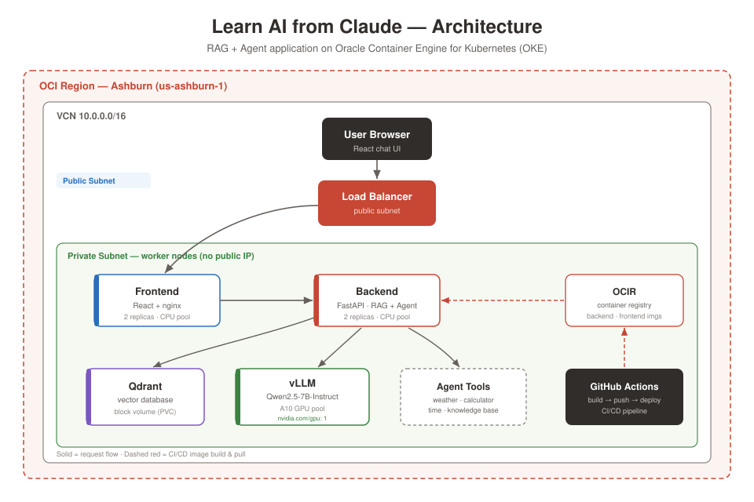

# Learn AI from Claude

A hands-on journey from a local FastAPI + LLM script to a full, cloud-native, GPU-accelerated AI application on Oracle Cloud Infrastructure — built end to end over six weeks.

[](https://cloud.oracle.com/resourcemanager/stacks/create?zipUrl=https://github.com/dkhopade/learn-ai-from-claude/archive/refs/heads/main.zip&workingDirectory=learn-ai-from-claude-main/infra)

## What this is

A RAG (Retrieval-Augmented Generation) and agent application with a React chat UI, deployed on Oracle Container Engine for Kubernetes (OKE), serving an open LLM (Qwen2.5-7B) on an A10 GPU via vLLM. All infrastructure is Terraform-managed and one-click deployable via OCI Resource Manager.

## Architecture


Request flow: a question is embedded, matched against documents in Qdrant, injected as context into a prompt, and answered by the LLM — grounded in your own data with sources cited. Agent mode adds autonomous tool-calling (time, calculator, live weather, knowledge-base search).

## Tech stack

- **App:** FastAPI, React, sentence-transformers, Qdrant
- **LLM serving:** vLLM (OpenAI-compatible API), Qwen2.5-7B-Instruct
- **Infra:** OKE, OCIR, VCN (private workers + NAT), A10 GPU nodepool — all via Terraform
- **CI/CD:** GitHub Actions (build → push to OCIR → deploy to OKE)
- **Portability:** OCI Resource Manager one-click deploy

## Repository structure

- `week1/` — FastAPI + local LLM streaming
- `week2/` — Embeddings + Qdrant semantic search
- `week3/` — Full RAG + React chat UI
- `week4/` — Agents + tool calling + conversation memory
- `week5/` — Cloud deployment: containers, k8s manifests, CI/CD
- `infra/` — Terraform stack (network, IAM, OCIR, OKE, GPU nodepool)

## The application layer (`week5/`)

- **Portable LLM client** (`llm_client.py`) — one env var (`LLM_BACKEND`) switches between local Ollama and in-cluster vLLM; same code runs both.
- **Backend-agnostic agent** (`agent.py`) — tool-calling works against both Ollama and vLLM's OpenAI-format API.
- **Kubernetes manifests** (`k8s/`) — Qdrant (persistent volume), backend, frontend (load balancer), vLLM (GPU).

## Deploying

**One-click:** use the Deploy to Oracle Cloud button above — it opens Resource Manager in your own tenancy, renders an input form from `infra/schema.yaml`, and deploys the full stack.

**Local Terraform:**
```bash
cd infra
cp terraform.tfvars.example terraform.tfvars   # fill in your values
terraform init
terraform apply                                 # CPU stack (network, IAM, OCIR, OKE)
terraform apply -var="enable_gpu=true"          # add the A10 GPU node for vLLM
```

**Connect kubectl (printed as a Terraform output):**
```bash
terraform output -raw kubeconfig_command | bash
kubectl get nodes
```

**Teardown:**
```bash
terraform destroy                               # everything
terraform apply -var="enable_gpu=false"         # or drop just the GPU to stop hourly billing
```

## CI/CD

Push to `main` triggers `.github/workflows/deploy.yml`:
1. Build backend + frontend images in GitHub runners
2. Push to OCIR (tagged with the git SHA)
3. Authenticate to OKE and roll out the updated manifests

Requires these GitHub repo secrets: `OCI_USER_OCID`, `OCI_FINGERPRINT`, `OCI_TENANCY_OCID`, `OCI_REGION`, `OCI_PRIVATE_KEY`, `OCIR_USERNAME`, `OCIR_AUTH_TOKEN`.

## Gotchas encountered (and solved)

Real issues hit during this build, documented so others don't lose hours:

- **OKE Kubernetes version drift** — supported versions change over time; read the error message for the current valid list rather than hardcoding.
- **Node shape/image incompatibility** — `VM.Standard.E4.Flex` failed to pair with the OL8 node image; `VM.Standard.E5.Flex` worked.
- **OKE network prerequisites** — worker nodes fail to register without specific cross-subnet security rules (ports 6443, 12250, 10250, plus ICMP path-MTU).
- **OCIR region-key mismatch** — the image pull secret must use the same registry hostname form (`iad.ocir.io`) as the image tags, or pulls fall back to anonymous and fail.
- **CRI-O short-name enforcement** — OKE nodes require fully-qualified image names (`docker.io/qdrant/qdrant:latest`, not `qdrant/qdrant`).
- **RWO volume deadlock** — a Deployment with a ReadWriteOnce volume needs `strategy: Recreate`, or two pods deadlock fighting over one volume during updates.
- **GPU boot volume too small** — a custom `boot_volume_size_in_gbs` provisions a larger disk but needs a cloud-init `oci-growfs` step to actually expand the filesystem onto it.
- **VLLM_PORT env collision** — Kubernetes auto-injects a `VLLM_PORT` service variable that collides with vLLM's own port config; set `VLLM_PORT` explicitly in the pod env.
- **GPU capacity errors** — "Out of host capacity" for A10s is transient; retry, or try a different availability domain.
- **Backend image size** — bundling full CUDA PyTorch on a CPU-only backend bloats the image to ~6GB; install CPU-only torch to shrink it.
- **Startup ordering** — the backend must retry-with-backoff connecting to Qdrant, since Kubernetes doesn't guarantee pod start order.

## Cost note

The A10 GPU nodepool bills hourly (~$2–3/hr depending on region). Keep `enable_gpu = false` unless actively testing inference, and tear down with `terraform destroy` when done. The rest of the stack (CPU nodes, load balancer, NAT) is modest but non-zero — full teardown is the safest way to reach zero cost, and everything rebuilds from `terraform apply`.

## Background

Built as a hands-on curriculum to develop end-to-end AI engineering muscle memory — spanning system design, RAG, agents, containerization, Kubernetes, GPU inference serving, Terraform IaC, and CI/CD — on an OCI-native stack.
